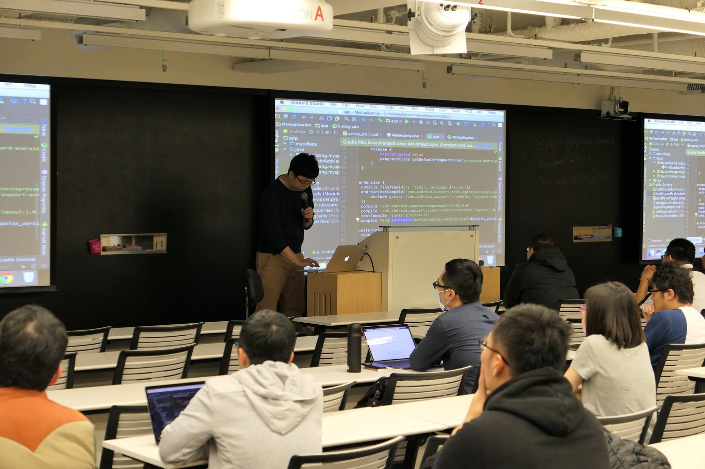
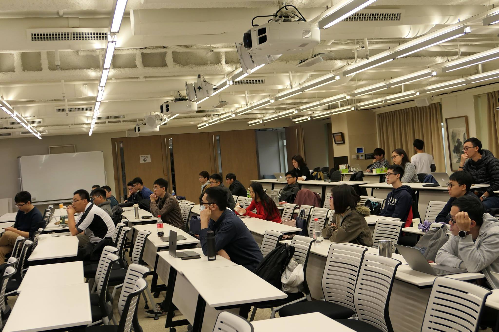
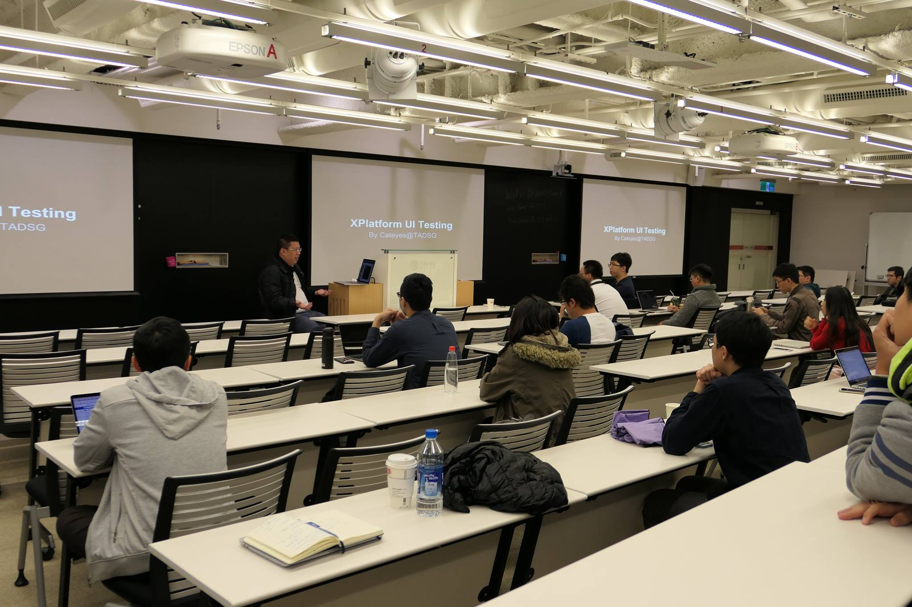
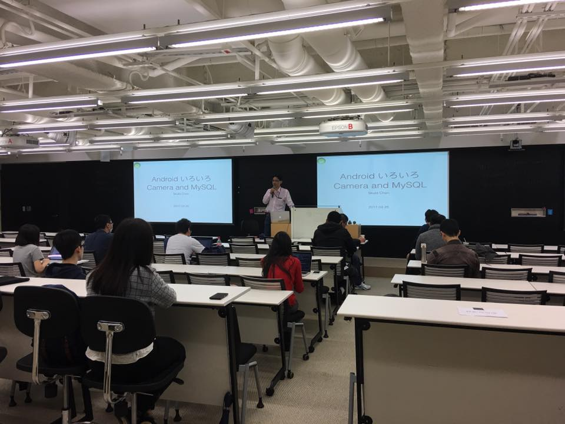

# 第37回Android Developer讀書會 活動紀錄

### Time

Saturday, March 25 at 2 PM - 5:30 PM

### Location

趨勢科技台北 Trend Micro Taipei Office

### Speaker
- 楊哲偉
- Cateyes Lin (貓大)

### Subject
- Kotlin 初體驗
- XPlatform UI Testing - Calabash

### Lighting Talk
- Skuld Chen
  - Android Camera, media codec, and file management 
  - Linux MySQL Replication. hot fix

### Link

[Facebook 活動網址](https://www.facebook.com/events/732935560196761/)  
[Meetup 活動網址](https://www.meetup.com/Taiwan-Android-Developer-Study-Group/events/238271961/)

### Material & Demo Code
[Kotlin 初體驗](https://www.slideshare.net/yangbng86/kotlin-73628549)  
[XPlatform UI Testing - Calabash](https://docs.google.com/presentation/d/1I_cEstDKE7AjSIN4oC7Wq4iHt-bRp-ZY6MQS2CTbVnQ/edit#slide=id.p)

### Photo

